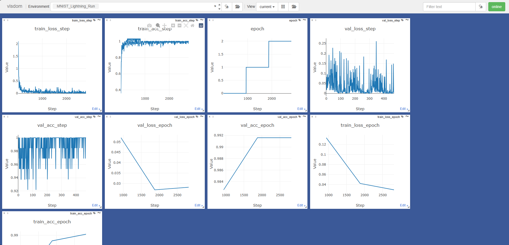

# PyTorch-Visdom Native Deep Integration & Auto-Logging
This repository contains the codes for the starter task of VISDOM project under GSoc 2026. More specifically its the starter tasks of "PyTorch-Native Deep Integration & Auto-Logging" project.
This project is a initiative towards automatic metric logging and deep framework integration between PyTorch, Lightning and Visdom, minimizing boilerplate code and making experiment tracking effortless.

## Project Overview

This project addresses a critical pain point in PyTorch model training: the need for repetitive manual metric logging. Instead of writing:

```python
# Current: Manual and repetitive logging
for epoch in range(100):
    loss = train_epoch()
    vis.line(Y=[loss], X=[epoch], win='loss', update='append')
    acc = validate()
    vis.line(Y=[acc], X=[epoch], win='acc', update='append')
    # ...repeat for every metric
```

The goal is to achieve:

```python
# Desired: Zero-config logging
trainer = Trainer(model, logger=VisdomLogger(port=8097))
trainer.fit()  # Automatically logs everything
```

### Key Objectives
- Automatic detection and logging of common training metrics (loss, accuracy, learning rate)
- Deep integration with PyTorch training workflows
- Reduction of manual instrumentation while maintaining flexibility
- Consistent and complete experiment tracking with minimal developer effort
- Performance overhead analysis for hook-based logging

---

## Tasks & Implementation

### Task 1: Manual CNN Training with Visdom Logging
**Objective**: Establish baseline PyTorch training with manual Visdom integration

**Deliverables**:
- Simple CNN model on MNIST dataset
- Manual metric tracking (loss, accuracy) for train/val splits
- Visdom visualization setup and configuration

**Key Files**:
- [src/Task1/cnn_model.py](src/Task1/cnn_model.py) - SimpleCNN architecture
- [src/Task1/dataset.py](src/Task1/dataset.py) - MNIST data loading
- [src/Task1/train.py](src/Task1/train.py) - Training loop with manual Visdom logging

**Architecture**:
```
SimpleCNN
├── Conv2d(1, 32, kernel_size=3)
├── ReLU
├── MaxPool2d(2)
├── Conv2d(32, 64, kernel_size=3)
├── ReLU
├── MaxPool2d(2)
├── Flatten
└── Linear(64*6*6, 10)
```

**Results**:


---

### Task 2 & 3: PyTorch Lightning Integration & Custom Logger

**Objective**: Implement a custom PyTorch Lightning logger that automatically logs metrics to Visdom

**Deliverables**:
- `SimpleVisdomLogger` - Custom Lightning Logger class
- `LitCNN` - Lightning module wrapper for SimpleCNN
- Automated metric tracking via Lightning's logging interface
- Reduction of boilerplate compared to Task 1

**Key Files**:
- [src/Task2_and_Task3/lightning_cnn_model.py](src/Task2_and_Task3/lightning_cnn_model.py) - LightningModule implementation
- [src/Task2_and_Task3/visdom_lightning_logger.py](src/Task2_and_Task3/visdom_lightning_logger.py) - Custom Lightning logger
- [src/Task2_and_Task3/train.py](src/Task2_and_Task3/train.py) - Training with automatic logging

**Key Features**:
- Automatic loss and accuracy logging
- Epoch/batch-level step tracking
- Window management for metric visualization
- Hyperparameter logging support
- Compatibility with Lightning's trainer interface

**Usage Example**:
```python
model = LitCNN(SimpleCNN())
vis_logger = SimpleVisdomLogger(env_name="MNIST_Lightning_Run")
trainer = L.Trainer(
    max_epochs=3,
    logger=vis_logger,
    log_every_n_steps=5
)
trainer.fit(model, train_dataloaders=train_loader, val_dataloaders=val_loader)
```

**Results**:


---

### Task 4: PyTorch Hook Overhead Analysis
**Objective**: Profile and measure the performance overhead of using PyTorch hooks for automatic logging

**Deliverables**:
- Hook-based gradient monitoring implementation
- Latency benchmarking (with/without hooks)
- Torch profiler analysis
- Overhead quantification report

**Key Files**:
- [src/Task4/pytorch_hook_overhead_benchmark.py](src/Task4/pytorch_hook_overhead_benchmark.py) - Profiling script

**Methodology**:
1. Baseline latency measurement (no hooks)
2. Register gradient hooks on all parameters
3. Execute training iterations and measure latency
4. Calculate overhead percentage
5. Use `torch.profiler` for detailed analysis
6. Generate profiling report

**Key Metrics Measured**:
- Per-iteration latency (with/without hooks)
- Overall overhead percentage
- Memory usage impact
- Hook execution time breakdown

**Results**:
- Profiling output saved to [results/Task-4/profiling output.txt](results/Task-4/profiling%20output.txt)
- Allows informed decisions on hook-based monitoring feasibility

---

### Task 5: Gradient Norm Logger with Hooks

**Objective**: Implement automatic gradient norm logging using PyTorch hooks - the "starter task" for contributor workflow

**Deliverables**:
- `VisdomGradientLogger` class for automatic gradient monitoring
- Hook registration and management system
- Batch-level gradient norm aggregation
- Visdom visualization of gradient statistics

**Key Files**:
- [src/Task5/visdom_gradient_logger.py](src/Task5/visdom_gradient_logger.py) - Core logger implementation
- [src/Task5/train_with_visdom_gradient_norm_logger.py](src/Task5/train_with_visdom_gradient_norm_logger.py) - Training integration example

**Features**:
- **Automatic hook registration** on all model parameters
- **Layer-wise gradient norm tracking**
- **Batch-level aggregation** to reduce network overhead
- **Real-time visualization** in Visdom
- **Cleanup mechanism** for resource management

**Usage Example**:
```python
model = SimpleCNN().to(device)
grad_logger = VisdomGradientLogger(model)

for epoch in range(num_epochs):
    for batch_idx, (data, target) in enumerate(train_loader):
        # Training code...
        loss.backward()
        optimizer.step()
        
        # Automatic logging of gradient norms
        grad_logger.log_step()

grad_logger.cleanup()
```

**Results**:


---

## Setup & Installation

### Prerequisites
- Python 3.7+
- PyTorch (with or without CUDA)
- PyTorch Lightning
- Visdom

### Installation Steps

1. **Clone or setup the project**:
```bash
cd e:\Visdom-PyTorch_Native_Deep_Integration_and_Auto_Logging
```

2. **Install dependencies**:
```bash
pip install -r requirements.txt
```

**Requirements**:
```
torch
torchvision
visdom
lightning
torchmetrics
```

3. **Start Visdom server** (in a separate terminal):
```bash
python -m visdom.server
```

The server will run at `http://localhost:8097`

---

## Running Each Task

### Task 1: Manual CNN Training
```bash
python -m src.Task1.train
```

**What it does**:
- Loads MNIST dataset (train/val split)
- Trains SimpleCNN for 5 epochs
- Manually logs loss and accuracy to Visdom
- Displays real-time training progress

**Expected Output**:
- Loss and accuracy curves on Visdom dashboard
- Console output with epoch-level metrics

---

### Task 2 & 3: PyTorch Lightning with Custom Logger
```bash
python -m src.Task2_and_Task3.train
```

**What it does**:
- Wraps SimpleCNN in a LightningModule
- Uses custom Visdom logger for automatic metric tracking
- Trains for 3 epochs with automatic logging
- Demonstrates reduction in boilerplate code

**Expected Output**:
- Automatic loss/accuracy tracking in Visdom
- Same metrics as Task 1, with less manual code

---

### Task 4: Profile Hook Overhead
```bash
python -m src.Task4.pytorch_hook_overhead_benchmark
```

**What it does**:
- Measures baseline latency (no hooks)
- Registers gradient hooks
- Measures latency with hooks
- Calculates overhead percentage
- Profiles execution with torch.profiler

**Expected Output**:
- Total overhead percentage
- Detailed profiling report
- Identification of bottlenecks

---

### Task 5: Gradient Norm Logger
```bash
python -m src.Task5.train_with_visdom_gradient_norm_logger
```

**What it does**:
- Registers hooks on all model parameters
- Automatically tracks gradient norms per layer
- Logs aggregated statistics per batch
- Visualizes gradient health in Visdom

**Expected Output**:
- Per-layer gradient norm tracking
- Batch-level aggregated statistics
- Visual representation of gradient flow

---

## Results Summary

| Task | Objective | Status | Outcome |
|------|-----------|--------|-----------|
| 1 | Manual Visdom logging | Completed | Baseline: Manual instrumentation required |
| 2-3 | Lightning integration | Completed | Reduced boilerplate via Logger interface |
| 4 | Hook overhead analysis | Completed | Profiling data collected |
| 5 | Gradient norm logger | Completed | Automatic layer-wise monitoring |

### Performance Insights
- Task 4 provides overhead quantification for hook-based monitoring
- Task 5 implements efficient batch-level aggregation to minimize overhead
- Integration maintains reasonable performance while enabling auto-logging

---

## Project Structure

```
.
├── README.md                          # This file
├── requirements.txt                   # Python dependencies
├── data/
│   └── MNIST/                         # MNIST dataset
│       └── raw/                       # Raw binary files
├── results/
│   ├── Task-1/                        # Task 1 visualizations
│   ├── Task-2-and-3/                  # Task 2-3 visualizations
│   ├── Task-4/                        # Profiling output
│   └── Task-5/                        # Gradient logger visualizations
└── src/
    ├── Task1/                         # Manual training
    │   ├── cnn_model.py              # SimpleCNN architecture
    │   ├── dataset.py                # Data loading
    │   └── train.py                  # Training loop
    ├── Task2_and_Task3/              # Lightning integration
    │   ├── lightning_cnn_model.py    # LightningModule wrapper
    │   ├── visdom_lightning_logger.py # Custom logger
    │   └── train.py                  # Lightning training
    ├── Task4/                         # Hook profiling
    │   └── pytorch_hook_overhead_benchmark.py
    └── Task5/                         # Gradient logger
        ├── visdom_gradient_logger.py
        └── train_with_visdom_gradient_norm_logger.py
```

---

## Key Concepts

### Auto-Logging
Reducing manual `vis.line()` calls by leveraging framework integration (Lightning loggers, PyTorch hooks)

### Hooks in PyTorch
Register functions that execute during backpropagation to capture gradient information without modifying model code

### Lightning Loggers
Custom logger classes that intercept metric logging and redirect to Visdom

### Gradient Monitoring
Tracking gradient norms as a diagnostic tool for training health and optimization quality

---

## Learning Outcomes

By completing this project, you will understand:

1. **PyTorch Fundamentals**: Model training loops, gradient computation, parameter updates
2. **Visdom Integration**: Real-time metric visualization and window management
3. **PyTorch Lightning**: Structured training with automatic logging via custom loggers
4. **Hook-Based Monitoring**: Capturing gradient information during backpropagation
5. **Performance Profiling**: Measuring overhead and identifying bottlenecks
6. **Framework Integration**: Reducing boilerplate through deep integration

---

## Notes

- Ensure Visdom server is running before executing any training script
- MNIST data is downloaded automatically on first run (requires ~50MB)
- GPU support is automatic if CUDA is available
- All visualization windows are created in specific environments (configurable)

---

## References

- **Visdom Documentation**: https://github.com/fossasia/visdom
- **PyTorch Documentation**: https://pytorch.org/docs/
- **PyTorch Lightning**: https://lightning.ai/docs/pytorch/latest/
- **PyTorch Hooks**: https://pytorch.org/tutorials/beginner/former_torchies/tensor_tutorial.html

---

## Summary

This project demonstrates a progression from manual metric logging (Task 1) → framework-integrated logging (Tasks 2-3) → performance-conscious automatic logging (Tasks 4-5). The result is a template for zero-config training visualization that maintains performance while maximizing developer productivity.

The implementation provides a foundation for contributing to Visdom with advanced PyTorch integration features.
